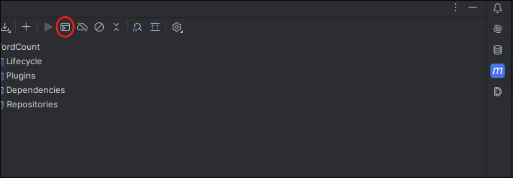

Tải file data (của tui) về rồi giải nén

```
https://drive.google.com/file/d/1GtN93GssK6BngvLkgrUW2UL9VtZbQuT7/view?usp=sharing
```

Dô file vừa giải nén, có 1 đống folder bai1 bai2 ..., mở terminal lên để thêm mấy file input vào hdfs:

```
hdfs dfs -mkdir /bai1
hdfs dfs -mkdir /bai2
hdfs dfs -mkdir /bai3
hdfs dfs -mkdir /bai4
hdfs dfs -mkdir /bai5
```

```
hdfs dfs -put ./Bai1/*.csv /bai1
hdfs dfs -put ./Bai2/*.csv /bai2
hdfs dfs -put ./Bai3/*.csv /bai3
hdfs dfs -put ./Bai4/*.csv /bai4
hdfs dfs -put ./Bai5/*.csv /bai5
```

Mở Intellij, nhìn vào thanh công cụ bên phải có chữ m(maven), ấn dô nó



Rồi ấn dô cái khoanh đỏ, ấn `mvn clean`, rồi tiếp như vậy, ấn `mvn install` để tạo jar file ở `target/`

Rồi dô readme từng bài copy lệnh chạy là xong
