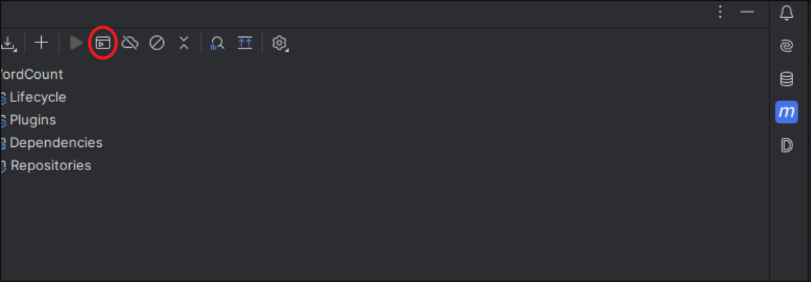

Mở Intellij, nhìn vào thanh công cụ bên phải có chữ m(maven), ấn dô nó



Rồi ấn dô cái khoanh đỏ, ấn `mvn clean`, rồi tiếp như vậy, ấy `mvn install` để tạo jar file ở `target/`

Rồi mở terminal chạy

```
hadoop jar target/BigData-a-di-da-phat-1.0-SNAPSHOT.jar com.bigdata.Bai1.Bai1a /bai1 /bai1_output
```

Chạy xong dô `http://localhost:9870/explorer.html#/bai1_output` là thấy file output
